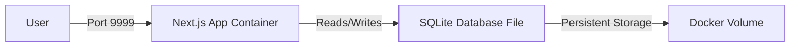

# Docker Setup for BCN News Application

## Overview
This project uses **SQLite** as the database with a single Docker container:
1. **Next.js Application** - Main web application with embedded SQLite database

## System Architecture



## Prerequisites

- Docker Desktop installed and running
- Docker Compose v3.8+
- At least 1GB of available RAM

## Quick Start

### 1. Start Container
```bash
pnpm docker:up
```
or
```bash
docker-compose up -d
```

### 2. View Logs
```bash
pnpm docker:logs
```
or
```bash
docker-compose logs -f
```

### 3. Stop Container
```bash
pnpm docker:down
```
or
```bash
docker-compose down
```

## Local Development (pnpm dev)

With SQLite, local development is much simpler - no Docker required!

### 1. Configure .env
Ensure your `.env` file uses SQLite:
```env
DATABASE_URL="file:./prisma/dev.db"
```

### 2. Initialize Database
```bash
npx prisma db push
```

### 3. Seed Database
```bash
npx prisma db seed
```

### 4. Start Development Server
```bash
pnpm dev
```

## Available Commands

| Command | Description |
|---------|-------------|
| `pnpm docker:build` | Build Docker image |
| `pnpm docker:up` | Start container in detached mode |
| `pnpm docker:down` | Stop and remove container |
| `pnpm docker:logs` | View container logs |

## Container Details

### Next.js App (bcn_app)
- **Build**: Multi-stage Dockerfile
- **Port**: `9999` (mapped to internal 3000)
- **Database**: SQLite file at `./prisma/prod.db`
- **Volume**: `sqlite_data` mounted at `/app/prisma` for persistence
- **Startup Process**:
  1. Syncs database schema (`prisma db push`)
  2. Starts the Next.js server

## Environment Variables

The container uses environment variables for configuration:

```env
# Database (SQLite)
DATABASE_URL="file:./prisma/prod.db"

# Next Auth
NEXTAUTH_SECRET="super-secret-development-key-change-in-prod"
NEXTAUTH_URL="http://localhost:9999"

# Admin Secret
ADMIN_SECRET="change-this-to-secure-secret"
```

## Data Persistence

SQLite database is stored in a Docker volume:
- **Volume Name**: `sqlite_data`
- **Location**: `/app/prisma` (inside container)
- **Database File**: `prod.db`
- **Persistence**: Data survives container restarts and rebuilds

## Troubleshooting

### Container won't start
```bash
# Check container status
docker ps -a

# View detailed logs
docker-compose logs
```

### Database issues
```bash
# Check database file
docker exec bcn_app ls -la /app/prisma/

# Reinitialize database
docker exec bcn_app npx prisma db push
```

### Reset everything
```bash
# Stop and remove containers, networks, and volumes
docker-compose down -v

# Rebuild and restart
pnpm docker:build
pnpm docker:up
```

### Port already in use
If port 9999 is already in use, modify `docker-compose.yml`:
```yaml
ports:
  - "8888:3000"  # Change 9999 to any available port
```

## Production Deployment

### Standard Deployment

For production:
1. Update `NEXTAUTH_SECRET` with a secure random string (use: `openssl rand -base64 32`)
2. Update `NEXTAUTH_URL` to your production domain (https://blainenews.n9xo.xyz)
3. Ensure Docker volume is backed up regularly
4. Configure a reverse proxy (nginx, Caddy) with SSL/TLS

### Watchtower Auto-Deployment with GitHub

The project uses **GitHub Actions** for automatic Docker builds and **Watchtower** for auto-deployment.

#### How It Works

1. **Push to GitHub** → Triggers GitHub Actions
2. **GitHub Actions** → Builds Docker image and pushes to GitHub Container Registry (ghcr.io)
3. **Watchtower on VPS** → Detects new image and auto-deploys

#### Setup on VPS (One-time)

1. **Create GitHub Personal Access Token (PAT)**:
   - Go to GitHub Settings → Developer settings → Personal access tokens → Tokens (classic)
   - Generate new token with `read:packages` permission
   - Copy the token

2. **Login to GHCR on VPS**:
   ```bash
   echo "YOUR_GITHUB_TOKEN" | docker login ghcr.io -u YOUR_GITHUB_USERNAME --password-stdin
   ```

3. **Set Environment Variable**:
   ```bash
   # Add to .env or .env.docker
   GITHUB_REPOSITORY=your-github-username/bcn
   ```

4. **Start Container**:
   ```bash
   docker-compose up -d
   ```

#### Deployment Workflow

Once set up, deployment is automatic:

```bash
# 1. Make changes to your code
# 2. Commit and push to GitHub
git add .
git commit -m "Your changes"
git push origin main

# 3. GitHub Actions automatically:
#    - Builds the Docker image
#    - Pushes to ghcr.io/your-username/bcn:latest

# 4. Watchtower on VPS automatically (within ~5 minutes):
#    - Detects the new image
#    - Pulls it from GHCR
#    - Stops the old container
#    - Starts the new container
#    - Cleans up old images
```

#### Manual Deployment (if needed)

```bash
# On VPS: Pull and restart manually
docker-compose pull app
docker-compose up -d app
```

#### Monitoring Deployments

```bash
# Check GitHub Actions status
# Visit: https://github.com/your-username/bcn/actions

# On VPS: View Watchtower logs
docker logs watchtower

# View app logs
docker-compose logs -f app
```

## Docker Build Stages

The Dockerfile uses multi-stage builds for optimization:

1. **deps**: Installs dependencies
2. **builder**: Generates Prisma client and builds Next.js
3. **runner**: Production runtime (minimal, optimized)

This results in a smaller final image (~180MB).

## Accessing the Application

Once container is running:
- **Web Application**: http://localhost:9999
- **Database**: SQLite file inside container (use docker exec to access)

## Database Backup & Restore

### Backup database
```bash
# Copy SQLite database from container to host
docker cp bcn_app:/app/prisma/prod.db ./backup-$(date +%Y%m%d).db
```

### Restore database
```bash
# Copy backup into container
docker cp ./backup-20250101.db bcn_app:/app/prisma/prod.db

# Restart container
docker-compose restart app
```

### Automated Backups
Consider setting up a cron job for regular backups:
```bash
# Add to crontab (daily backup at 2am)
0 2 * * * docker cp bcn_app:/app/prisma/prod.db /backups/bcn-$(date +\%Y\%m\%d).db
```

## Maintenance

### View container stats
```bash
docker stats bcn_app
```

### Access container shell
```bash
docker exec -it bcn_app sh
```

### View database file
```bash
docker exec bcn_app ls -lh /app/prisma/prod.db
```

## SQLite vs PostgreSQL

This project now uses SQLite for simplified deployment. Benefits:

✅ **Simpler setup** - No separate database container
✅ **Easier backups** - Single file to backup
✅ **Lower resource usage** - Less memory and CPU
✅ **Faster local development** - No Docker needed
✅ **Portability** - Database file can be easily moved

Limitations to be aware of:

⚠️ **Concurrent writes** - Lower than PostgreSQL
⚠️ **Network access** - Database must be on same machine
⚠️ **Scaling** - Better for small to medium traffic sites

For this news site with primarily read operations, SQLite is an excellent choice.
